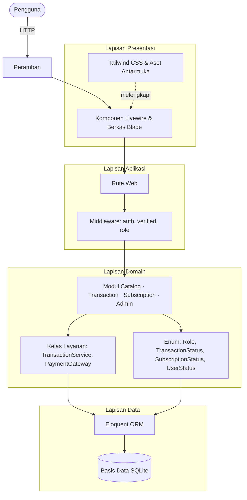
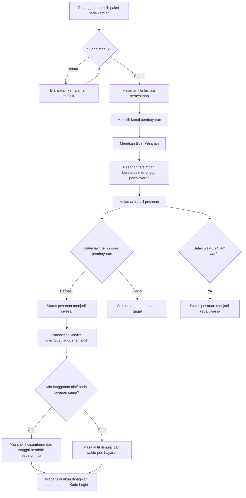
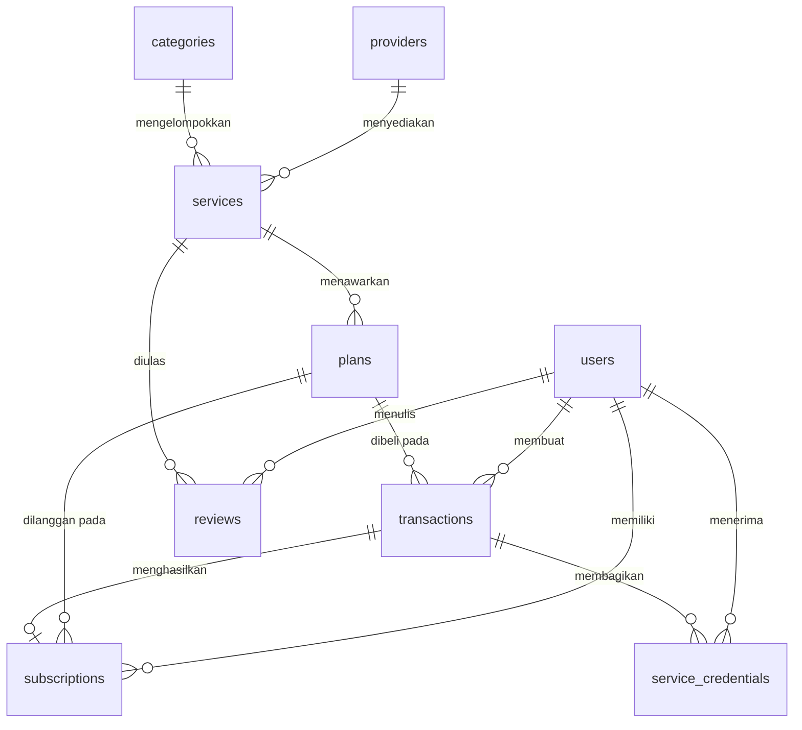
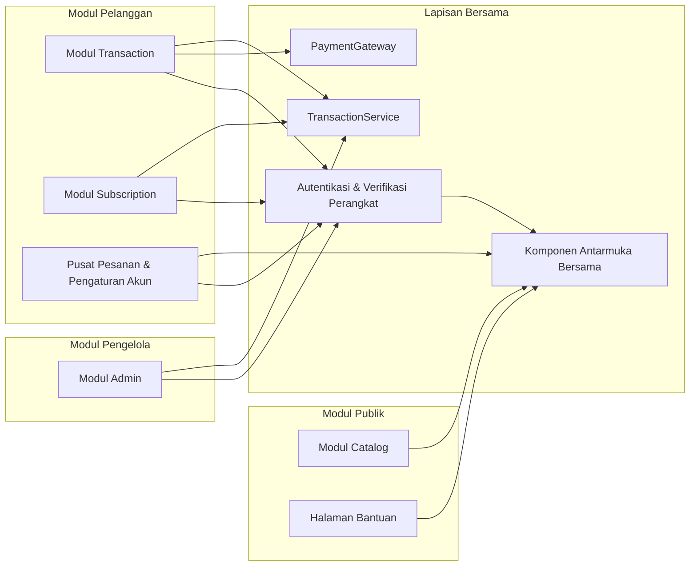

# CATATAN SEBELUM SALIN-TEMPEL

Dokumen ini berisi **BAB 4 RANCANGAN SISTEM** untuk SRS PRIM Kelompok 7
(Google Docs: `1sbDCDj-tGnm5zx4LHXKl0IeorkRQVRdT`).

**Cara pakai:** blok bagian di bawah garis pemisah, copy, lalu paste ke Google Docs.
Setelah paste, rapikan format (Heading 1/2/3, indentasi tabel, dan cetak miring istilah asing).

## Yang perlu Anda kerjakan manual setelah paste

### A. Gambar yang harus disisipkan

Google Docs tidak menerima gambar dari Markdown. Setelah paste, sisipkan gambar lewat
*Insert → Image → Upload from computer* pada posisi yang sudah ditandai
**`[[SISIPKAN GAMBAR DI SINI: ...]]`**.

| Gambar | Isi | Cara mendapatkannya |
|---|---|---|
| 4-1 | Arsitektur HMVC PRIM | Render blok Mermaid di bawah (mis. mermaid.live), lalu simpan PNG |
| 4-2 | ERD basis data | Render blok Mermaid ERD di bawah |
| 4-3 | Diagram komponen aplikasi | Render blok Mermaid di bawah |
| 4-4 | Alur pemesanan sampai langganan aktif | Render blok Mermaid di bawah |
| 4-5 s/d 4-15 | Tangkapan layar tiap halaman (11 gambar) | Jalankan aplikasi, tangkap layar sesuai daftar di Subbab 4.4 |

Sebelas tangkapan layar yang perlu Anda ambil:

| Gambar | Halaman | Cara membuka |
|---|---|---|
| 4-5 | Beranda | `http://127.0.0.1:8000/` |
| 4-6 | Katalog layanan | `http://127.0.0.1:8000/katalog` |
| 4-7 | Cara Berlangganan | `http://127.0.0.1:8000/cara-berlangganan` |
| 4-8 | Login | `http://127.0.0.1:8000/login` |
| 4-9 | Pusat pesanan pengguna | Masuk `andi@prim.test` → `/profil/pesanan` |
| 4-10 | Kode Login | `/profil/kode-login` |
| 4-11 | Dashboard pengelola | Masuk `admin@prim.com` → `/admin` |
| 4-12 | Manajemen pesanan | `/admin/pesanan` |
| 4-13 | Manajemen pengguna | `/admin/pengguna` |
| 4-14 | Laporan | `/admin/laporan` |
| 4-15 | Pengaturan notifikasi | `/admin/pengaturan/notifikasi` |

### B. Nomor tabel dan gambar

Nomor di dokumen ini sudah disesuaikan dengan SRS Anda:
Bab 3 memakai **Tabel 3-1 s/d 3-32** (use case description) dan **Gambar 3-1 s/d 3-4**
(use case diagram). Karena itu Bab 4 dimulai dari **Tabel 4-1** dan **Gambar 4-1**.

Bila jumlah tabel/gambar di Bab 3 berbeda dari asumsi ini, cukup geser penomoran
secara berurutan — isinya tidak perlu diubah.

### C. Yang perlu Anda sesuaikan sendiri

- **Versi teknologi** pada Tabel 4-16: versi PHP/Node di komputer Anda mungkin berbeda.
  Isi sesuai hasil `php -v` dan `node -v` di komputer tempat Anda menangkap layar.
- **Tanggal** pada Catatan Revisi.
- Bila dosen meminta **diagram aktivitas atau diagram kelas**, dua diagram di Bab 4 ini
  dapat dipakai: **Gambar 4-2** (diagram alur proses, setara diagram aktivitas) dan
  **Gambar 4-4** (diagram komponen yang memperlihatkan hubungan antar modul).

---

# BAB 4
# RANCANGAN SISTEM

Bab ini memaparkan rancangan sistem PRIM yang diturunkan dari kebutuhan pada Bab 2
dan model sistem pada Bab 3. Rancangan disusun pada tiga tataran: **arsitektur**
(Cara sistem disusun), **basis data** (Cara data disimpan), dan **antarmuka**
(Bentuk yang dilihat pengguna).

---

## 4.1 Arsitektur Sistem

### 4.1.1 Gambaran Umum

PRIM dirancang sebagai aplikasi web berbasis **arsitektur berlapis (layered architecture)**
yang di dalamnya menerapkan pola **HMVC (Hierarchical Model–View–Controller)**. Pola ini
dipilih karena PRIM dibangun dari empat modul fungsional yang batas tanggung jawabnya
jelas (Catalog, Transaction, Subscription, dan Admin), namun tetap berbagi satu basis
data dan satu mekanisme autentikasi yang sama.

Sistem disusun atas empat lapisan:

| Lapisan | Tanggung jawab | Wujud dalam implementasi |
|---|---|---|
| **Presentasi** | Menampilkan antarmuka dan menangani interaksi pengguna tanpa memuat ulang halaman | Komponen Livewire, berkas Blade, Tailwind CSS |
| **Aplikasi** | Mengatur alur permintaan, validasi masukan, otorisasi, dan navigasi | Rute, middleware, komponen aksi |
| **Domain** | Menjalankan aturan bisnis inti yang tidak bergantung pada antarmuka | Model Eloquent, enum status, kelas layanan |
| **Data** | Menyimpan dan mengambil data | Eloquent ORM, SQLite |

Pemisahan ini membuat aturan bisnis tidak bercampur dengan kode tampilan. Sebagai
contoh, perubahan status transaksi menjadi berhasil selalu melewati satu kelas layanan
(`TransactionService`) yang di dalamnya membungkus pembaruan transaksi dan pembuatan
langganan dalam satu transaksi basis data. Dengan demikian, halaman pengelola, halaman
pembayaran, dan perintah terjadwal memakai aturan yang sama persis.

### 4.1.2 Pembagian Modul

Sistem dibagi menjadi empat modul. Setiap modul berdiri sendiri dengan berkas
komponen, tampilan, rute, dan basis datanya sendiri, sehingga satu modul dapat
diubah tanpa mengganggu modul lain.

**Tabel 4-1. Pembagian modul sistem**

| No | Modul | Cakupan fungsional | Aktor utama |
|---|---|---|---|
| 1 | **Catalog** | Katalog layanan, pencarian, penyaringan, pengurutan, detail layanan, komparasi, panduan berlangganan | Pengunjung, Pelanggan |
| 2 | **Transaction** | Pemesanan (checkout), pemrosesan pembayaran, riwayat dan detail pesanan | Pelanggan |
| 3 | **Subscription** | Daftar langganan, masa aktif, perpanjangan, perpanjangan otomatis | Pelanggan |
| 4 | **Admin** | Dashboard metrik, pengelolaan master data, verifikasi pesanan, laporan, pengaturan | Administrator |

Selain empat modul tersebut, terdapat lapisan bersama (*shared layer*) yang dipakai
seluruh modul, yaitu autentikasi (masuk, daftar, pemulihan kata sandi, verifikasi
perangkat), pengaturan akun, pusat pesanan pengguna, halaman bantuan, serta komponen
antarmuka bersama seperti logo, kartu layanan, lencana status, dan tombol.

### 4.1.3 Hubungan Antar Lapisan

**[[SISIPKAN GAMBAR DI SINI: Gambar 4-1 Arsitektur HMVC PRIM]]**

*Gambar 4-1 Arsitektur HMVC PRIM*

Gambar 4-1 memperlihatkan bahwa permintaan pengguna selalu melewati lapisan aplikasi
terlebih dahulu untuk keperluan autentikasi dan otorisasi, baru kemudian diteruskan
ke modul yang bersangkutan. Lapisan domain tidak pernah mengakses basis data secara
langsung tanpa melalui Eloquent, sehingga relasi antar entitas tetap terjaga.

### 4.1.4 Rancangan Keamanan dan Otorisasi

Rancangan otorisasi dibuat berlapis, tidak hanya bergantung pada tampilan.

| Tingkat | Mekanisme | Keterangan |
|---|---|---|
| **Autentikasi** | Middleware `auth` | Halaman pesanan, langganan, dan panel pengelola hanya dapat dibuka setelah masuk |
| **Verifikasi surel** | Middleware `verified` | Membatasi akses sebelum surel terverifikasi |
| **Otorisasi peran** | Middleware `role:admin` | Panel pengelola hanya untuk peran `admin`; pengunjung dengan peran lain ditolak |
| **Isolasi data** | Penyaringan pada kueri | Setiap kueri transaksi dan langganan disaring dengan `user_id` pengguna yang sedang masuk |
| **Kebijakan akses** | `SubscriptionPolicy`, `TransactionPolicy` | Menolak akses terhadap data milik pengguna lain pada tingkat model |
| **Proteksi CSRF** | Token pada setiap formulir | Seluruh permintaan pengubah data menyertakan token CSRF |
| **Pembatasan percobaan** | Rate limiter | Percobaan masuk dibatasi 5 kali; permintaan kode verifikasi dibatasi 5 kali per 5 menit |

Rancangan ini menjawab kebutuhan non-fungsional NF-01, NF-02, dan NF-03 pada Bab 2.

### 4.1.5 Rancangan Alur Proses Utama

Alur berikut menggambarkan proses bisnis paling penting, yaitu dari pemesanan sampai
langganan aktif. Alur ini menjadi acuan bagi rancangan antarmuka pada Subbab 4.4.

**[[SISIPKAN GAMBAR DI SINI: Gambar 4-2 Diagram Alur Pemesanan sampai Langganan Aktif]]**

*Gambar 4-2 Diagram alur pemesanan sampai langganan aktif*

Titik penting pada Gambar 4-2 adalah langkah **K**: pembuatan langganan tidak
dilakukan oleh antarmuka, melainkan oleh kelas layanan. Hal ini menjamin bahwa
langganan hanya lahir dari transaksi yang benar-benar berhasil, termasuk ketika
status diubah secara manual oleh administrator.

---

## 4.2 Rancangan Basis Data

### 4.2.1 Entity Relationship Diagram

Basis data PRIM terdiri atas sembilan tabel. Delapan tabel merupakan entitas utama
dan satu tabel (`service_credentials`) merupakan entitas pendukung yang menyimpan
kredensial akun layanan untuk pesanan yang sudah berhasil.

**[[SISIPKAN GAMBAR DI SINI: Gambar 4-3 ERD Basis Data PRIM]]**

*Gambar 4-3 Entity Relationship Diagram basis data PRIM*

### 4.2.2 Kamus Data

Kamus data berikut disusun dari struktur tabel yang benar-benar diterapkan pada
sistem. Kolom bertanda **PK** adalah kunci utama, **FK** adalah kunci asing, dan
**U** adalah kunci unik.

#### a. Tabel `users`

**Tabel 4-2. Kamus data tabel users**

| Atribut | Keterangan | Tipe Data | Kunci | Nullable |
|---|---|---|---|---|
| id | Identitas unik pengguna | Integer | PK | Tidak |
| name | Nama lengkap pengguna | Varchar | — | Tidak |
| email | Surel, dipakai untuk masuk | Varchar | U | Tidak |
| email_verified_at | Waktu verifikasi surel | Datetime | — | Ya |
| password | Kata sandi ter-hash (bcrypt) | Varchar | — | Tidak |
| role | Peran: `user`, `admin`, `provider` | Varchar(20) | — | Tidak (bawaan `user`) |
| status | Status akun: `aktif`, `non_aktif`, `suspend` | Varchar(20) | — | Tidak (bawaan `aktif`) |
| last_login_at | Waktu masuk terakhir | Datetime | — | Ya |
| phone | Nomor telepon atau WhatsApp | Varchar(30) | — | Ya |
| address | Alamat pengguna | Varchar | — | Ya |
| avatar_path | Lokasi berkas foto profil | Varchar | — | Ya |
| settings | Preferensi antarmuka dalam format JSON, termasuk saklar notifikasi | Text (JSON) | — | Ya |
| remember_token | Token sesi "ingat saya" | Varchar | — | Ya |
| created_at | Waktu record dibuat | Datetime | — | Ya |
| updated_at | Waktu record diubah | Datetime | — | Ya |

#### b. Tabel `providers`

**Tabel 4-3. Kamus data tabel providers**

| Atribut | Keterangan | Tipe Data | Kunci | Nullable |
|---|---|---|---|---|
| id | Identitas penyedia | Integer | PK | Tidak |
| name | Nama penyedia layanan | Varchar | — | Tidak |
| slug | Nama unik untuk URL | Varchar | U | Tidak |
| logo_path | Lokasi berkas logo penyedia | Varchar | — | Ya |
| website | Situs web resmi penyedia | Varchar | — | Ya |
| description | Deskripsi penyedia | Text | — | Ya |
| created_at, updated_at | Waktu dibuat dan diubah | Datetime | — | Ya |

#### c. Tabel `categories`

**Tabel 4-4. Kamus data tabel categories**

| Atribut | Keterangan | Tipe Data | Kunci | Nullable |
|---|---|---|---|---|
| id | Identitas kategori | Integer | PK | Tidak |
| name | Nama kategori | Varchar | — | Tidak |
| slug | Nama unik untuk URL | Varchar | U | Tidak |
| icon | Nama ikon kategori | Varchar | — | Ya |
| description | Deskripsi kategori | Text | — | Ya |
| created_at, updated_at | Waktu dibuat dan diubah | Datetime | — | Ya |

#### d. Tabel `services`

**Tabel 4-5. Kamus data tabel services**

| Atribut | Keterangan | Tipe Data | Kunci | Nullable |
|---|---|---|---|---|
| id | Identitas layanan | Integer | PK | Tidak |
| provider_id | Penyedia pemilik layanan | Integer | FK → `providers.id` | Tidak |
| category_id | Kategori layanan | Integer | FK → `categories.id` | Tidak |
| name | Nama layanan premium | Varchar | — | Tidak |
| slug | Nama unik untuk URL | Varchar | U | Tidak |
| tagline | Ringkasan singkat layanan | Varchar | — | Ya |
| description | Deskripsi lengkap layanan | Text | — | Ya |
| logo_path | Lokasi berkas logo layanan | Varchar | — | Ya |
| website | Situs web layanan | Varchar | — | Ya |
| is_active | Status tampil di katalog | Boolean | — | Tidak (bawaan benar) |
| created_at, updated_at | Waktu dibuat dan diubah | Datetime | — | Ya |

#### e. Tabel `plans`

Tabel ini menyimpan **varian paket** pada setiap layanan. Satu layanan dapat memiliki
beberapa varian (misalnya "1 Perangkat", "2 Perangkat", "Bulanan", "Tahunan"), dan
setiap varian menampilkan harga, daftar periode tagihan, serta pita diskonnya.

**Tabel 4-6. Kamus data tabel plans**

| Atribut | Keterangan | Tipe Data | Kunci | Nullable |
|---|---|---|---|---|
| id | Identitas varian paket | Integer | PK | Tidak |
| service_id | Layanan pemilik paket | Integer | FK → `services.id` | Tidak |
| name | Nama varian paket | Varchar | — | Tidak |
| variant_group | Nama kelompok varian, mis. "Bulanan" atau "1 Perangkat" | Varchar(60) | — | Ya |
| price | Harga paket dalam rupiah | Integer | — | Tidak |
| compare_at_price | Harga sebelum diskon, untuk harga coret | Integer | — | Ya |
| discount_percent | Persentase diskon yang tampil pada pita kartu | Integer | — | Tidak (bawaan 0) |
| duration_days | Durasi paket dalam hari | Integer | — | Tidak |
| periods_label | Daftar periode tagihan yang dapat dipilih, mis. "1, 2, 3, 6 bln" | Varchar(40) | — | Ya |
| max_devices | Jumlah perangkat bersamaan | Integer | — | Tidak (bawaan 1) |
| description | Deskripsi singkat paket | Text | — | Ya |
| features | Daftar fitur dalam format JSON | Text (JSON) | — | Ya |
| is_active | Status paket dapat dibeli | Boolean | — | Tidak (bawaan benar) |
| is_preorder | Penanda paket preorder | Boolean | — | Tidak (bawaan salah) |
| stock | Jumlah stok akun yang tersedia | Integer | — | Tidak (bawaan 0) |
| created_at, updated_at | Waktu dibuat dan diubah | Datetime | — | Ya |

#### f. Tabel `transactions`

**Tabel 4-7. Kamus data tabel transactions**

| Atribut | Keterangan | Tipe Data | Kunci | Nullable |
|---|---|---|---|---|
| id | Identitas transaksi | Integer | PK | Tidak |
| order_code | Kode pesanan unik, format `PRIM-YYYYMMDD-XXXXXX` | Varchar | U | Tidak |
| user_id | Pengguna pembeli | Integer | FK → `users.id` | Tidak |
| plan_id | Varian paket yang dibeli | Integer | FK → `plans.id` | Tidak |
| amount | Nominal pembayaran | Integer | — | Tidak |
| status | Status pesanan (lihat Tabel 4-11) | Varchar(20) | — | Tidak (bawaan `pending`) |
| payment_method | Kode kanal pembayaran | Varchar(50) | — | Ya |
| payment_method_label | Nama kanal pembayaran untuk ditampilkan, mis. "E-Wallet (Dana)" | Varchar(60) | — | Ya |
| paid_at | Waktu pembayaran berhasil | Datetime | — | Ya |
| expires_at | Batas waktu pembayaran (24 jam) | Datetime | — | Ya |
| notes | Catatan status dari sistem | Text | — | Ya |
| created_at, updated_at | Waktu dibuat dan diubah | Datetime | — | Ya |

#### g. Tabel `subscriptions`

**Tabel 4-8. Kamus data tabel subscriptions**

| Atribut | Keterangan | Tipe Data | Kunci | Nullable |
|---|---|---|---|---|
| id | Identitas langganan | Integer | PK | Tidak |
| user_id | Pemilik langganan | Integer | FK → `users.id` | Tidak |
| plan_id | Varian paket yang dilanggan | Integer | FK → `plans.id` | Tidak |
| transaction_id | Transaksi sumber langganan | Integer | FK, U → `transactions.id` | Tidak |
| status | Status langganan: `active`, `expired`, `cancelled` | Varchar(20) | — | Tidak (bawaan `active`) |
| started_at | Awal masa aktif | Datetime | — | Tidak |
| ends_at | Akhir masa aktif | Datetime | — | Tidak |
| auto_renew | Status perpanjangan otomatis | Boolean | — | Tidak (bawaan salah) |
| cancelled_at | Waktu pembatalan | Datetime | — | Ya |
| created_at, updated_at | Waktu dibuat dan diubah | Datetime | — | Ya |

Kolom `transaction_id` bersifat unik karena satu transaksi hanya boleh melahirkan
satu langganan. Batasan ini mencegah langganan ganda bila status transaksi diubah
dua kali.

#### h. Tabel `reviews`

**Tabel 4-9. Kamus data tabel reviews**

| Atribut | Keterangan | Tipe Data | Kunci | Nullable |
|---|---|---|---|---|
| id | Identitas ulasan | Integer | PK | Tidak |
| user_id | Penulis ulasan | Integer | FK, U gabungan → `users.id` | Tidak |
| service_id | Layanan yang diulas | Integer | FK, U gabungan → `services.id` | Tidak |
| rating | Nilai 1 sampai 5 | Integer | — | Tidak |
| comment | Komentar ulasan | Text | — | Ya |
| created_at, updated_at | Waktu dibuat dan diubah | Datetime | — | Ya |

Kunci unik gabungan `user_id` + `service_id` menjamin satu pengguna hanya dapat
menulis satu ulasan untuk satu layanan.

#### i. Tabel `service_credentials`

Tabel pendukung yang menyimpan kredensial akun layanan untuk pesanan yang sudah
berhasil dibayar. Data ini hanya ditampilkan kepada pembeli pesanan terkait.

**Tabel 4-10. Kamus data tabel service_credentials**

| Atribut | Keterangan | Tipe Data | Kunci | Nullable |
|---|---|---|---|---|
| id | Identitas kredensial | Integer | PK | Tidak |
| transaction_id | Pesanan sumber kredensial | Integer | FK → `transactions.id` | Tidak |
| user_id | Pembeli yang berhak memakainya | Integer | FK → `users.id` | Tidak |
| label | Keterangan kredensial, mis. "Netflix — 2 Perangkat" | Varchar | — | Ya |
| login_code | Kode atau surel untuk masuk ke akun layanan | Varchar | — | Tidak |
| password_code | Kata sandi akun layanan | Varchar | — | Ya |
| profile_name | Nama profil pada akun layanan | Varchar | — | Ya |
| pin_code | PIN akun layanan bila ada | Varchar(20) | — | Ya |
| notes | Catatan tambahan dari pengelola | Text | — | Ya |
| delivered_at | Waktu kredensial dibagikan | Datetime | — | Ya |
| created_at, updated_at | Waktu dibuat dan diubah | Datetime | — | Ya |

### 4.2.3 Rancangan Nilai Status

Nilai status tidak disimpan sebagai teks bebas, melainkan dibatasi oleh objek
*keluaran* (enum) pada lapisan domain. Rancangan ini mencegah nilai status yang
tidak dikenal masuk ke basis data.

**Tabel 4-11. Rancangan nilai status pesanan**

| Nilai tersimpan | Label antarmuka | Kelompok warna | Kapan dipakai |
|---|---|---|---|
| `pending` | Menunggu Pembayaran | Kuning | Pesanan dibuat, menunggu pembayaran |
| `processed` | Diproses | Biru | Pembayaran terverifikasi, pesanan sedang dikerjakan |
| `paid` | Selesai | Hijau | Pesanan selesai; langganan aktif dibuat |
| `accepted` | Pesanan Diterima | Hijau | Pelanggan mengonfirmasi pesanan diterima |
| `waiting_process` | Menunggu Proses | Biru | Menunggu antrean pengerjaan |
| `follow_up` | Ditindak Lanjuti | Kuning | Perlu tindakan lanjutan dari pelanggan atau pengelola |
| `proof_renewal` | Pembaharuan Bukti | Ungu | Bukti pembayaran perlu diperbarui |
| `proof_revision` | Revisi Bukti | Merah | Bukti pembayaran perlu direvisi |
| `grace` | Masa Tenggang | Kuning | Melewati masa aktif namun masih diberi tenggang |
| `failed` | Gagal | Merah | Pembayaran gagal |
| `expired` | Kedaluwarsa | Merah | Melewati batas waktu pembayaran |
| `cancelled` | Dibatalkan | Merah | Pesanan dibatalkan |

**Tabel 4-12. Rancangan nilai status akun dan langganan**

| Enum | Nilai | Label | Perilaku sistem |
|---|---|---|---|
| `UserStatus` | `aktif` | Aktif | Akun dapat masuk |
| `UserStatus` | `non_aktif` | Non-aktif | Akun tidak dapat masuk |
| `UserStatus` | `suspend` | Suspend | Akun diblokir sementara |
| `SubscriptionStatus` | `active` | Aktif | Masa aktif berjalan |
| `SubscriptionStatus` | `expired` | Berakhir | Masa aktif telah lewat |
| `SubscriptionStatus` | `cancelled` | Dibatalkan | Langganan dihentikan |

### 4.2.4 Rancangan Aturan Integritas Data

Integritas data dijaga pada dua tingkat: basis data dan lapisan domain.

| Aturan | Diterapkan pada | Akibat bila dilanggar |
|---|---|---|
| Surel pengguna unik | Kunci unik `users.email` | Pendaftaran ditolak dengan pesan validasi |
| Slug penyedia, kategori, dan layanan unik | Kunci unik tiap tabel | Penyimpanan ditolak |
| Kode pesanan unik | Kunci unik `transactions.order_code` | Kode dibuat ulang otomatis |
| Satu transaksi melahirkan satu langganan | Kunci unik `subscriptions.transaction_id` | Pembuatan langganan ganda dicegah |
| Satu ulasan per pengguna per layanan | Kunci unik gabungan `reviews` | Ulasan kedua ditolak |
| Penghapusan penyedia/kategori/layanan yang masih dipakai dicegah | Kait model | Penghapusan dibatalkan dengan pesan |
| Riwayat transaksi dan langganan dipertahankan | Kunci asing dengan pembatasan | Penghapusan data induk ditolak |
| Pembayaran dibungkus transaksi basis data | Kelas layanan | Bila gagal, seluruh perubahan dibatalkan |

---

## 4.3 Rancangan Teknologi

### 4.3.1 Pilihan Teknologi

**Tabel 4-13. Rancangan pilihan teknologi**

| Bagian | Teknologi | Alasan pemilihan |
|---|---|---|
| Kerangka kerja | Laravel 12 | Menyediakan routing, ORM, migrasi, autentikasi, dan pengujian dalam satu paket; memenuhi kebutuhan NF-13 (kemudahan pemeliharaan) |
| Antarmuka dinamis | Livewire 3 | Interaksi tanpa memuat ulang halaman (pencarian, penyaringan, paginasi) tanpa menulis kode JavaScript terpisah; memenuhi NF-10 (kinerja katalog) |
| Komponen antarmuka | Flux UI 2 | Menyediakan komponen siap pakai yang konsisten dan mendukung mode gelap |
| Gaya tampilan | Tailwind CSS 4 | Kelas utilitas mempercepat penyesuaian tampilan terhadap desain Figma dan menjaga konsistensi jarak serta warna |
| Modularisasi | nwidart/laravel-modules | Mewujudkan pemisahan empat modul PRIM sesuai pola HMVC |
| Basis data | SQLite | Ringan, tidak memerlukan server terpisah, dan memadai untuk skala demonstrasi akademik; mudah dipindahkan ke MySQL bila diperlukan |
| Pengujian | Pest | Sintaks ringkas dan menyatu dengan Laravel; memenuhi NF-14 (keterujian) |
| Diagram | Mermaid | Diagram disimpan sebagai teks sehingga dapat ditinjau ulang melalui Git bersama kode programnya |

### 4.3.2 Rancangan Antarmuka Pembayaran (Payment Gateway)

Integrasi penyedia pembayaran nyata berada di luar cakupan versi ini. Meskipun
demikian, rancangan tetap menyediakan **batas antarmuka** (interface) agar penggantian
penyedia pembayaran tidak mengubah modul transaksi.

**Tabel 4-14. Rancangan batas antarmuka pembayaran**

| Peran | Nama | Tanggung jawab |
|---|---|---|
| Kontrak | `PaymentGateway` | Menetapkan satu operasi: memproses pembayaran atas sebuah transaksi |
| Hasil | `PaymentResult` | Membawa status keberhasilan, pesan, dan waktu pembayaran |
| Penerapan simulasi | `MockPaymentGateway` | Menjalankan pembayaran tiruan untuk keperluan demonstrasi |

Karena modul transaksi hanya bergantung pada kontrak `PaymentGateway`, pergantian ke
penyedia pembayaran sungguhan cukup dilakukan dengan menukar penerapan pada
penyedia layanan aplikasi, tanpa mengubah satu baris pun pada modul Transaction.
Rancangan ini memenuhi catatan Batasan Sistem pada Bab 2.

### 4.3.3 Rancangan Diagram Komponen

**[[SISIPKAN GAMBAR DI SINI: Gambar 4-4 Diagram Komponen Aplikasi]]**

*Gambar 4-4 Diagram komponen aplikasi PRIM*

---

## 4.4 Rancangan Antarmuka

Rancangan antarmuka PRIM disusun mengikuti berkas desain Figma kelompok
(`PRIM_KELOMPOK7`). Setiap halaman pada rancangan memiliki padanan langsung dengan
rute, komponen, dan peran pengguna yang mengaksesnya. Tabel berikut menjadi acuan
bagi seluruh Subbab 4.4.

**Tabel 4-15. Ringkasan rancangan antarmuka seluruh modul**

| Modul | Halaman | Rute | Akses |
|---|---|---|---|
| Bersama | Beranda | `/` | Publik |
| Bersama | Login, Daftar, Lupa Kata Sandi, Reset Kata Sandi, Verifikasi Perangkat | `/login`, `/register`, `/kode-login`, `/forgot-password`, `/reset-password/{token}` | Publik |
| Bersama | Laporan Kendala | `/laporan-kendala` | Publik |
| Catalog | Katalog Layanan | `/katalog` | Publik |
| Catalog | Detail Layanan | `/katalog/{slug}` | Publik |
| Catalog | Perbandingan Layanan | `/bandingkan` | Publik |
| Catalog | Cara Berlangganan | `/cara-berlangganan` | Publik |
| Transaction | Konfirmasi Pemesanan | `/checkout/{plan}` | Pelanggan |
| Transaction | Riwayat Transaksi | `/transaksi` | Pelanggan |
| Transaction | Detail Pesanan | `/transaksi/{order_code}` | Pelanggan |
| Subscription | Langganan Saya | `/langganan` | Pelanggan |
| Subscription | Perpanjangan Langganan | `/langganan/{id}/perpanjang` | Pelanggan |
| Bersama | Pusat Pesanan | `/profil/pesanan` | Pelanggan |
| Bersama | Kode Login | `/profil/kode-login` | Pelanggan |
| Bersama | Pengaturan Akun | `/settings/profile`, `/settings/password`, `/settings/appearance` | Pelanggan |
| Admin | Dashboard | `/admin` | Administrator |
| Admin | Manajemen Pesanan | `/admin/pesanan` | Administrator |
| Admin | Manajemen Pembayaran | `/admin/pembayaran` | Administrator |
| Admin | Manajemen Pengguna | `/admin/pengguna` | Administrator |
| Admin | Manajemen Produk | `/admin/produk` | Administrator |
| Admin | Manajemen Paket | `/admin/produk/{service}/paket` | Administrator |
| Admin | Kategori dan Penyedia | `/admin/kategori`, `/admin/penyedia` | Administrator |
| Admin | Laporan | `/admin/laporan` | Administrator |
| Admin | Pengaturan Pengelola | `/admin/pengaturan/profil`, `/admin/pengaturan/notifikasi` | Administrator |

### 4.4.1 Rancangan Antarmuka Modul Catalog

**Tabel 4-16. Rancangan antarmuka modul Catalog**

| No | Halaman | Rute | Fungsi utama | Gambar |
|---|---|---|---|---|
| 1 | Beranda | `/` | Hero pengantar, layanan populer, keunggulan, ajakan mendaftar | Gambar 4-5 |
| 2 | Katalog Layanan | `/katalog` | Kolom pencarian, penyaring kategori dan urutan, grid kartu layanan 4 kolom berisi logo merek, varian paket, tag periode, pita diskon, tombol Pesan, dan paginasi | Gambar 4-6 |
| 3 | Cara Berlangganan | `/cara-berlangganan` | Lima kartu langkah berlangganan dan sebelas logo kanal pembayaran | Gambar 4-7 |

**[[SISIPKAN GAMBAR DI SINI: Gambar 4-5 Beranda]]**

*Gambar 4-5 Rancangan antarmuka halaman Beranda*

**[[SISIPKAN GAMBAR DI SINI: Gambar 4-6 Katalog Layanan]]**

*Gambar 4-6 Rancangan antarmuka halaman Katalog Layanan*

**[[SISIPKAN GAMBAR DI SINI: Gambar 4-7 Cara Berlangganan]]**

*Gambar 4-7 Rancangan antarmuka halaman Cara Berlangganan*

Penjelasan rancangan kartu layanan pada katalog: setiap kartu menampilkan lambang
merek layanan pada bagian atas, nama layanan, lalu daftar varian paket. Setiap varian
menampilkan nama kelompok varian, harga per bulan, dan tag periode tagihan yang
tersedia. Bila varian sedang berdiskon, sebuah pita bertuliskan "Diskon n%" tampil di
sudut kiri atas kartu; bila paket bersifat preorder, pita bertuliskan "Preorder" yang
tampil. Bila sebuah layanan belum memiliki varian aktif, kartu menampilkan keterangan
"Produk Varian tidak tersedia" agar kondisi itu tetap terbaca jelas.

### 4.4.2 Rancangan Antarmuka Modul Transaction

**Tabel 4-17. Rancangan antarmuka modul Transaction**

| No | Halaman | Rute | Fungsi utama |
|---|---|---|---|
| 1 | Konfirmasi Pemesanan | `/checkout/{plan}` | Ringkasan paket, pemilihan kanal pembayaran, rincian biaya, pemberitahuan perpanjangan |
| 2 | Riwayat Transaksi | `/transaksi` | Daftar pesanan pengguna beserta penyaring status dan paginasi |
| 3 | Detail Pesanan | `/transaksi/{order_code}` | Status pesanan, instruksi pembayaran, tombol simulasi berhasil/gagal, rincian pesanan |

Rancangan pada modul ini menekankan kejelasan status. Setiap pesanan selalu
menampilkan kode pesanan, status dalam bentuk lencana berwarna, nominal, dan batas
waktu pembayaran. Warna lencana mengikuti pemetaan pada Tabel 4-11 dan Tabel 4-12
sehingga pengguna dapat mengenali kondisi pesanan tanpa membaca teks panjang.

### 4.4.3 Rancangan Antarmuka Modul Subscription

**Tabel 4-18. Rancangan antarmuka modul Subscription**

| No | Halaman | Rute | Fungsi utama |
|---|---|---|---|
| 1 | Langganan Saya | `/langganan` | Ringkasan jumlah langganan, penyaring, kartu langganan dengan bilah kemajuan masa aktif dan sisa hari, aksi perpanjang, saklar perpanjangan otomatis |
| 2 | Perpanjangan Langganan | `/langganan/{id}/perpanjang` | Pemilihan paket perpanjangan pada layanan yang sama |

Rancangan pada modul ini menekankan **kesadaran waktu**. Setiap kartu langganan
menampilkan bilah kemajuan yang membandingkan waktu berjalan dengan total masa aktif,
disertai jumlah hari tersisa. Langganan yang tinggal sedikit hari diberi penanda
warna peringatan, sedangkan langganan yang telah berakhir ditampilkan pada bagian
terpisah.

### 4.4.4 Rancangan Antarmuka Modul Admin

**Tabel 4-19. Rancangan antarmuka modul Admin**

| No | Halaman | Rute | Fungsi utama | Gambar |
|---|---|---|---|---|
| 1 | Dashboard | `/admin` | Kartu metrik, pendapatan bulan berjalan, diagram pesanan 14 hari, komposisi status, produk terlaris, pesanan terbaru | Gambar 4-11 |
| 2 | Manajemen Pesanan | `/admin/pesanan` | Kartu ringkasan, tab status, pencarian, tabel pesanan, verifikasi manual | Gambar 4-12 |
| 3 | Manajemen Pengguna | `/admin/pengguna` | Kartu ringkasan status, pencarian, tabel pengguna, pengubahan peran dan status | Gambar 4-13 |
| 4 | Manajemen Produk | `/admin/produk` | Kartu ringkasan produk, penyaring, tabel produk, aksi kelola paket | — |
| 5 | Manajemen Pembayaran | `/admin/pembayaran` | Rekap pendapatan, penyaring kanal pembayaran, tabel transaksi | — |
| 6 | Laporan | `/admin/laporan` | Kartu insight, diagram pendapatan bulanan, komposisi status, produk terlaris | Gambar 4-14 |
| 7 | Pengaturan | `/admin/pengaturan/profil`, `/admin/pengaturan/notifikasi` | Informasi pribadi pengelola dan delapan saklar notifikasi | Gambar 4-15 |

**[[SISIPKAN GAMBAR DI SINI: Gambar 4-11 Dashboard Pengelola]]**

*Gambar 4-11 Rancangan antarmuka Dashboard Pengelola*

**[[SISIPKAN GAMBAR DI SINI: Gambar 4-12 Manajemen Pesanan]]**

*Gambar 4-12 Rancangan antarmuka Manajemen Pesanan*

**[[SISIPKAN GAMBAR DI SINI: Gambar 4-13 Manajemen Pengguna]]**

*Gambar 4-13 Rancangan antarmuka Manajemen Pengguna*

**[[SISIPKAN GAMBAR DI SINI: Gambar 4-14 Laporan]]**

*Gambar 4-14 Rancangan antarmuka Laporan*

**[[SISIPKAN GAMBAR DI SINI: Gambar 4-15 Pengaturan Notifikasi]]**

*Gambar 4-15 Rancangan antarmuka Pengaturan Notifikasi*

Penjelasan rancangan tata letak panel pengelola: seluruh halaman pengelola memakai
satu kerangka tetap berupa **bilah samping ungu** di kiri dan **area konten putih** di
kanan. Bilah samping memuat menu Dashboard, Pesanan, Pengguna, Produk, Pembayaran,
dan Laporan, lalu Pengaturan dan Keluar di bagian bawah. Kepala area konten memuat
tanggal hari ini, lonceng notifikasi dengan penghitung pesanan yang perlu ditangani,
serta avatar, nama, dan peran pengguna. Kerangka tetap ini memenuhi kebutuhan
non-fungsional NF-07 mengenai navigasi yang konsisten.

### 4.4.5 Rancangan Antarmuka Bersama

**Tabel 4-20. Rancangan antarmuka bersama**

| No | Halaman | Fungsi utama | Gambar |
|---|---|---|---|
| 1 | Login | Masuk dengan surel dan kata sandi | Gambar 4-8 |
| 2 | Verifikasi Perangkat | Masuk dengan kode sekali pakai yang dikirim ke surel | — |
| 3 | Daftar | Pendaftaran akun baru dengan nama, surel, nomor WhatsApp, dan kata sandi | — |
| 4 | Lupa dan Reset Kata Sandi | Pemulihan kata sandi melalui surel | — |
| 5 | Laporan Kendala | Pengarahan ke kanal WhatsApp resmi dengan pesan yang sudah disiapkan | — |
| 6 | Pusat Pesanan | Daftar pesanan pengguna dengan sembilan tab status dan pencarian | Gambar 4-9 |
| 7 | Kode Login | Kredensial akun layanan per pesanan berhasil, tersembunyi sampai diminta | Gambar 4-10 |
| 8 | Pengaturan Akun | Profil, kata sandi, dan tampilan | — |

**[[SISIPKAN GAMBAR DI SINI: Gambar 4-8 Halaman Login]]**

*Gambar 4-8 Rancangan antarmuka halaman Login*

**[[SISIPKAN GAMBAR DI SINI: Gambar 4-9 Pusat Pesanan Pengguna]]**

*Gambar 4-9 Rancangan antarmuka Pusat Pesanan Pengguna*

**[[SISIPKAN GAMBAR DI SINI: Gambar 4-10 Kode Login]]**

*Gambar 4-10 Rancangan antarmuka halaman Kode Login*

Dua rancangan perlu dijelaskan secara khusus karena menyangkut keamanan data:

**Pertama, halaman Kode Login.** Nilai kredensial (kode masuk, kata sandi, dan PIN)
tidak ditampilkan saat halaman dibuka. Pengguna harus menekan tombol "Tampilkan"
terlebih dahulu. Rancangan ini mengurangi risiko kredensial terbaca orang lain yang
kebetulan melihat layar. Halaman juga hanya memuat kredensial milik pengguna yang
sedang masuk, sehingga tidak ada kemungkinan data pengguna lain terbaca.

**Kedua, halaman Verifikasi Perangkat.** Pada versi ini pengiriman surel belum
dikonfigurasi, sehingga kode verifikasi ditampilkan langsung pada halaman sebagai
sarana demonstrasi. Keterangan mengenai hal ini disertakan pada antarmuka agar
penguji tidak salah paham bahwa sistem mengirim surel.

### 4.4.6 Rancangan Sistem Warna dan Tipografi

Rancangan antarmuka memakai satu keluarga warna dan satu skala tipografi yang
diterapkan secara konsisten pada seluruh halaman.

**Tabel 4-21. Rancangan palet warna**

| Peran warna | Nilai | Pemakaian |
|---|---|---|
| Warna utama (brand) | `#534AB7` | Tombol utama, kartu langkah, bilah samping pengelola |
| Warna utama muda | `#6C63D5` | Latar hero halaman publik |
| Warna permukaan | `#D3CFFF` | Latar bilah navigasi dan footer |
| Warna aksen | `#8B5CF6` | Tombol pada halaman autentikasi dan tautan |
| Warna teks utama | `#333333` | Isi teks |
| Warna teks sekunder | `#6B7280` | Label, keterangan, dan teks bantu |
| Garis | `#B8B8B8` | Batas tabel dan pemisah |
| Kanvas | `#F8F9FA` | Latar kartu ringkasan dan area kosong |
| Selesai | `#EAF3DE` / `#3B6D11` | Lencana status selesai |
| Diproses | `#E6F1FB` / `#0C447C` | Lencana status diproses |
| Menunggu | `#FAEEDA` / `#854F0B` | Lencana status menunggu |
| Dibatalkan | `#FCEBEB` / `#E24B4A` | Lencana status dibatalkan |

**Tabel 4-22. Rancangan tipografi**

| Peran | Jenis huruf | Ketebalan | Ukuran |
|---|---|---|---|
| Judul utama halaman | DM Sans | 700 | 30 sampai 52 piksel |
| Judul bagian | DM Sans | 600 | 16 sampai 20 piksel |
| Isi teks dan antarmuka pengelola | Inter | 400, 500, 600 | 11 sampai 20 piksel |
| Halaman autentikasi | Poppins | 400, 500, 700 | 16 sampai 40 piksel |

Pemilihan huruf sans-serif dengan ketebalan berbeda pada setiap peran membuat
hierarki informasi terbaca tanpa perlu banyak garis pemisah. Rancangan ini
mendukung kebutuhan non-fungsional NF-07 mengenai antarmuka yang ramah pengguna dan
NF-08 mengenai penggunaan Bahasa Indonesia pada seluruh label.

---

## 4.5 Kesesuaian Rancangan dengan Kebutuhan

Rancangan pada Bab 4 ditelusuri kembali terhadap kebutuhan fungsional dan
non-fungsional pada Bab 2 untuk memastikan tidak ada kebutuhan yang tertinggal.

**Tabel 4-23. Penelusuran kebutuhan fungsional ke rancangan**

| Kebutuhan | Rancangan yang memenuhinya |
|---|---|
| F-01 s/d F-07 (katalog dan komparasi) | Subbab 4.4.1; halaman Beranda, Katalog, Detail Layanan, Perbandingan, Cara Berlangganan |
| F-08 s/d F-11 (pemesanan dan langganan otomatis) | Subbab 4.1.5 dan 4.4.2; alur Gambar 4-2 dan kelas `TransactionService` |
| F-12 s/d F-14 (daftar, perpanjangan, otomatis) | Subbab 4.4.3 |
| F-15 (pesanan kedaluwarsa) | Subbab 4.1.5 langkah Q dan Tabel 4-11 |
| F-16 s/d F-22 (panel pengelola) | Subbab 4.4.4 |
| F-23 (pengelolaan akun) | Subbab 4.4.5 |

**Tabel 4-24. Penelusuran kebutuhan non-fungsional ke rancangan**

| Kebutuhan | Rancangan yang memenuhinya |
|---|---|
| NF-01, NF-02 (autentikasi dan peran) | Subbab 4.1.4, Tabel 4-13 |
| NF-03 (isolasi data) | Subbab 4.1.4 dan 4.2.4 |
| NF-04, NF-05 (kata sandi ter-hash, CSRF) | Subbab 4.1.4, Tabel 4-2 |
| NF-06 (validasi masukan) | Subbab 4.2.4 |
| NF-07 (antarmuka ramah pengguna) | Subbab 4.4.4 sampai 4.4.6 |
| NF-08 (Bahasa Indonesia) | Subbab 4.4.6 |
| NF-10 (kinerja katalog) | Subbab 4.3.1; pemuatan relasi dan paginasi pada `/katalog` |
| NF-11 (integritas data) | Subbab 4.2.4 |
| NF-12 (audit sederhana) | Tabel 4-7 dan 4-10 |
| NF-13 (kemudahan pemeliharaan) | Subbab 4.1.2, Tabel 4-13 |
| NF-14 (keterujian) | Tabel 4-25 |

---

## 4.6 Rancangan Pengujian

Rancangan pengujian disusun untuk membuktikan bahwa rancangan pada bab ini benar-benar
diterapkan, bukan sekadar rancangan di atas kertas.

**Tabel 4-25. Ringkasan rancangan pengujian**

| Jenis pengujian | Cakupan | Cara |
|---|---|---|
| Pengujian unit | Perilaku model, enum, dan perhitungan (harga per bulan, sisa hari, kode pesanan) | Pengujian otomatis Pest |
| Pengujian fitur | Alur katalog, transaksi, langganan, panel pengelola, autentikasi | Pengujian otomatis Pest |
| Pengujian rute menyeluruh | 32 rute utama dipastikan merender tanpa galat untuk tamu, pelanggan, dan administrator | Pemeriksaan otomatis |
| Pengujian tampilan | Kesesuaian tampilan dengan berkas desain Figma pada lebar layar 1440, 1024, dan 390 piksel | Pemeriksaan manual dengan tangkapan layar |
| Pengujian lintas peramban | Chrome, Firefox, dan Edge | Pemeriksaan manual, sesuai NF-09 |

**Tabel 4-26. Hasil pengujian yang telah dijalankan**

| Pemeriksaan | Cakupan | Hasil |
|---|---|---|
| Pengujian otomatis | 157 pengujian dengan 462 pemeriksaan | Seluruhnya lulus |
| Pemeriksaan rute | 32 rute utama untuk tiga peran pengguna | Seluruhnya merender tanpa galat |
| Pemeriksaan aset | 27 logo merek, 11 logo kanal pembayaran, dan 8 aset halaman tampil pada antarmuka | Seluruhnya tampil |
| Pemeriksaan tempat penyimpanan | Basis data SQLite terisi 27 layanan, 43 varian paket, 18 akun, dan 20 pesanan | Sesuai rancangan |

---

## 4.7 Catatan Penerapan Rancangan

Beberapa hal perlu dicatat agar pembaca memahami batas antara rancangan dan
penerapan pada versi ini.

1. **Rancangan dibuat lebih dahulu, penerapan mengikutinya.** Seluruh halaman pada
   Subbab 4.4 mengikuti berkas desain Figma kelompok, sehingga rancangan antarmuka
   tidak dibuat setelah kode program selesai.

2. **Pembayaran masih berupa simulasi.** Sesuai Batasan Sistem pada Bab 2, integrasi
   penyedia pembayaran nyata berada di luar cakupan. Rancangan tetap menyediakan
   batas antarmuka `PaymentGateway` (Tabel 4-14) agar penggantian penyedia dapat
   dilakukan tanpa mengubah modul transaksi.

3. **Pengiriman surel belum dikonfigurasi.** Karena itu kode verifikasi perangkat
   ditampilkan langsung pada halaman `/kode-login` sebagai sarana demonstrasi.

4. **Halaman Perbandingan Layanan tidak tergambar pada berkas desain Figma.** Fitur
   ini tetap dipertahankan karena diwajibkan oleh kebutuhan F-06 dan F-07, dengan
   tampilan yang diturunkan dari pola kartu katalog agar tetap konsisten.

5. **Sebagian ilustrasi pada berkas desain belum tersedia sebagai aset terpisah.**
   Halaman tetap menampilkan kerangka pengganti agar tata letak tidak bergeser,
   sehingga penambahan aset di kemudian hari tidak mengubah susunan halaman.
