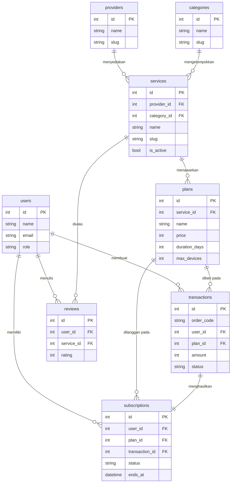
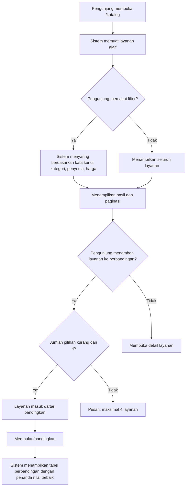
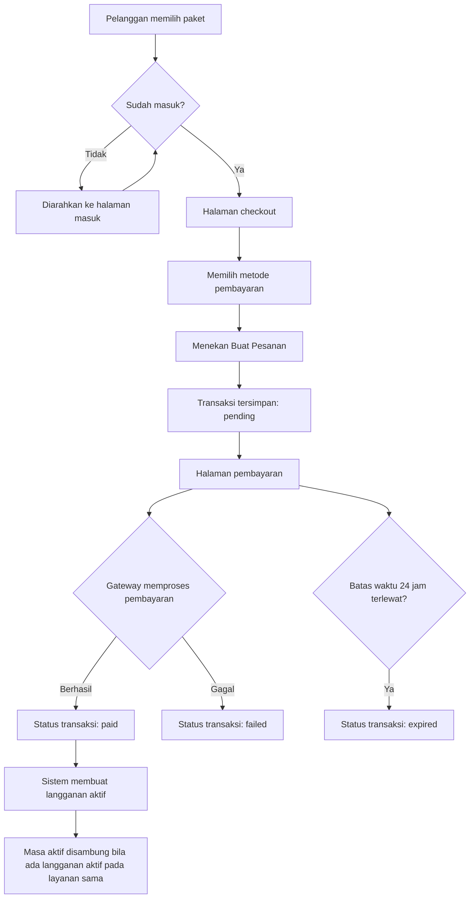
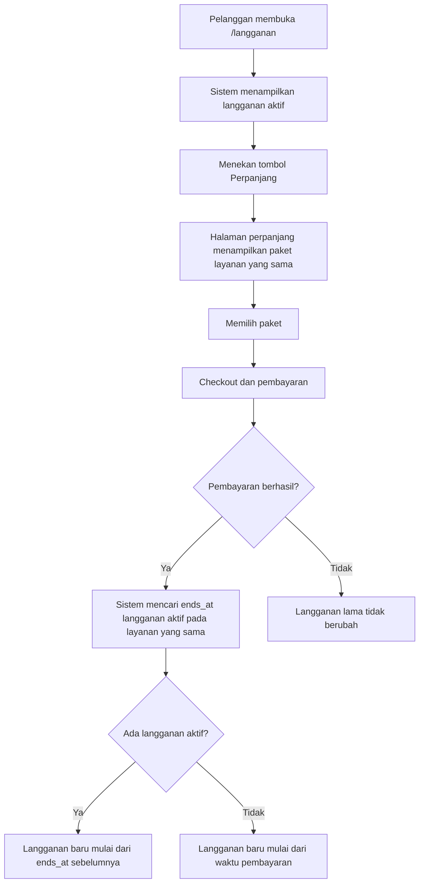

# Sinkronisasi SRS dengan Implementasi PRIM

Dokumen ini melengkapi **SRS IEEE Kelompok 7** dengan isi yang sudah benar-benar
 diterapkan pada kode program. Gunakan berkas ini untuk melengkapi bagian SRS yang
masih berupa template (`<...>`), khususnya Bab 2.5, Bab 3, dan Bab 4.

> **Cara pakai:** salin tabel dan diagram di bawah ini ke dokumen Google Docs
> SRS Kelompok 7 pada bagian yang sesuai, lalu ganti sisa placeholder
> `data organisasi` / `Organisasi` / `KategoriFile` yang masih berasal dari template.

---

## 1. Nama Modul Sistem (menggantikan `<Nama Modul 1..3>`)

Sistem PRIM terdiri atas **4 modul** berikut.

| No | Modul | Cakupan |
|---|---|---|
| 1 | **Catalog** | Katalog layanan, pencarian, filter, detail layanan, komparasi |
| 2 | **Transaction** | Checkout, pembayaran, riwayat transaksi |
| 3 | **Subscription** | Daftar langganan, masa aktif, perpanjangan |
| 4 | **Admin** | Dashboard metrik, pengelolaan seluruh master data |

---

## 2. Kebutuhan Fungsional (mengisi Tabel 2-1)

| No. | Kebutuhan Fungsional (FITUR) | Keterangan |
|---|---|---|
| F-01 | Menampilkan katalog layanan premium | Menampilkan seluruh layanan aktif beserta penyedia, kategori, dan harga paket termurah |
| F-02 | Mencari layanan | Pencarian kata kunci pada nama, tagline, dan deskripsi layanan |
| F-03 | Memfilter layanan | Filter berdasarkan kategori, penyedia, dan batas harga |
| F-04 | Mengurutkan hasil katalog | Urut berdasarkan terbaru, harga terendah/tertinggi, atau nama layanan |
| F-05 | Menampilkan detail layanan | Menampilkan deskripsi, penyedia, kategori, seluruh paket aktif, fitur, dan rating |
| F-06 | Membandingkan layanan | Komparasi side-by-side 2–4 layanan pada harga, jumlah paket, perangkat, durasi, dan fitur |
| F-07 | Mengelola daftar perbandingan | Menambah/menghapus layanan dari daftar bandingkan (maksimal 4) |
| F-08 | Melakukan pemesanan (checkout) | Memilih paket dan metode pembayaran lalu membuat pesanan |
| F-09 | Memproses pembayaran | Memproses pembayaran melalui gateway dan memperbarui status transaksi |
| F-10 | Menampilkan riwayat transaksi | Daftar transaksi pengguna beserta filter status dan detail pesanan |
| F-11 | Mengaktifkan langganan otomatis | Transaksi berhasil otomatis membuat langganan aktif |
| F-12 | Menampilkan daftar langganan | Menampilkan langganan aktif, akan berakhir, dan sudah berakhir beserta sisa hari |
| F-13 | Memperpanjang langganan | Membuat transaksi perpanjangan; masa aktif disambung dari tanggal berakhir sebelumnya |
| F-14 | Mengelola perpanjangan otomatis | Mengaktifkan/mematikan perpanjangan otomatis sebuah langganan |
| F-15 | Menandai transaksi kedaluwarsa | Pesanan yang melewati batas waktu pembayaran otomatis berstatus kedaluwarsa |
| F-16 | Menampilkan dashboard pengelola | Metrik layanan, paket, penyedia, pengguna, langganan aktif, transaksi menunggu, dan pendapatan bulan berjalan |
| F-17 | Mengelola data penyedia | Menambah, menyunting, menghapus, dan mengunggah logo penyedia |
| F-18 | Mengelola data kategori | Menambah, menyunting, dan menghapus kategori |
| F-19 | Mengelola data layanan | Menambah, menyunting, menghapus, mengunggah logo, serta mengaktifkan/menonaktifkan layanan |
| F-20 | Mengelola data paket | Menambah, menyunting, dan menghapus paket pada sebuah layanan |
| F-21 | Mengelola data pengguna | Mencari pengguna dan mengubah perannya |
| F-22 | Memverifikasi transaksi | Administrator dapat menandai transaksi berhasil atau gagal secara manual |
| F-23 | Mengelola akun pengguna | Registrasi, masuk, keluar, ubah profil, ubah kata sandi, dan hapus akun |

---

## 3. Kebutuhan Non Fungsional (mengisi Tabel 2-2)

| No. | Kebutuhan Non Fungsional | Keterangan |
|---|---|---|
| NF-01 | Autentikasi | Seluruh halaman transaksi, langganan, dan panel pengelola hanya dapat diakses setelah masuk |
| NF-02 | Otorisasi berbasis peran | Peran `user`, `provider`, dan `admin`; panel pengelola hanya untuk `admin` |
| NF-03 | Isolasi data antar pengguna | Pengguna hanya dapat melihat transaksi dan langganan miliknya sendiri |
| NF-04 | Keamanan kata sandi | Kata sandi disimpan dalam bentuk hash (bcrypt) |
| NF-05 | Proteksi CSRF | Seluruh formulir dilindungi token CSRF |
| NF-06 | Validasi masukan | Seluruh form tervalidasi di sisi server, termasuk tipe berkas dan ukuran unggahan |
| NF-07 | Antarmuka ramah pengguna | Desain responsif, navigasi konsisten, mendukung mode gelap, dan pesan status yang jelas |
| NF-08 | Ketersediaan Bahasa Indonesia | Seluruh label, pesan, dan format mata uang memakai Bahasa Indonesia (Rp) |
| NF-09 | Kompatibilitas peramban | Diuji pada peramban modern (Chrome, Firefox, Edge) |
| NF-10 | Kinerja katalog | Pencarian dan filter dijalankan di sisi basis data dengan paginasi; relasi dimuat sekali (eager loading) untuk menghindari kueri berulang |
| NF-11 | Integritas data | Penghapusan data yang masih direferensikan dicegah; transaksi pembayaran dibungkus dalam transaksi basis data |
| NF-12 | Audit sederhana | Setiap transaksi menyimpan kode pesanan unik, waktu dibuat, waktu bayar, dan catatan status |
| NF-13 | Kemudahan pemeliharaan | Arsitektur modular (HMVC) dengan pemisahan logika bisnis pada lapisan service |
| NF-14 | Keterujian | Perilaku utama ditutup oleh pengujian otomatis |

---

## 4. Kamus Data (menggantikan Tabel 3-3)

### 4.1 Entitas `users`

| Atribut | Keterangan | Tipe Data | Primary Key | Foreign Key |
|---|---|---|---|---|
| id | Identitas unik pengguna | Integer | Ya | — |
| name | Nama lengkap pengguna | Varchar | — | — |
| email | Surel, dipakai untuk masuk | Varchar | — | — |
| email_verified_at | Waktu verifikasi surel | Timestamp | — | — |
| password | Kata sandi ter-hash | Varchar | — | — |
| role | Peran: `user`, `admin`, `provider` | Varchar | — | — |
| phone | Nomor telepon | Varchar | — | — |
| avatar_path | Lokasi berkas foto profil | Varchar | — | — |
| remember_token | Token sesi "ingat saya" | Varchar | — | — |
| created_at, updated_at | Waktu dibuat dan diubah | Timestamp | — | — |

### 4.2 Entitas `providers`

| Atribut | Keterangan | Tipe Data | Primary Key | Foreign Key |
|---|---|---|---|---|
| id | Identitas penyedia | Integer | Ya | — |
| name | Nama penyedia layanan | Varchar | — | — |
| slug | Nama unik untuk URL | Varchar | — | — |
| logo_path | Lokasi berkas logo | Varchar | — | — |
| website | Situs web resmi penyedia | Varchar | — | — |
| description | Deskripsi penyedia | Text | — | — |
| created_at, updated_at | Waktu dibuat dan diubah | Timestamp | — | — |

### 4.3 Entitas `categories`

| Atribut | Keterangan | Tipe Data | Primary Key | Foreign Key |
|---|---|---|---|---|
| id | Identitas kategori | Integer | Ya | — |
| name | Nama kategori | Varchar | — | — |
| slug | Nama unik untuk URL | Varchar | — | — |
| icon | Nama ikon kategori | Varchar | — | — |
| description | Deskripsi kategori | Text | — | — |
| created_at, updated_at | Waktu dibuat dan diubah | Timestamp | — | — |

### 4.4 Entitas `services`

| Atribut | Keterangan | Tipe Data | Primary Key | Foreign Key |
|---|---|---|---|---|
| id | Identitas layanan | Integer | Ya | — |
| provider_id | Penyedia pemilik layanan | Integer | — | Ke `providers.id` |
| category_id | Kategori layanan | Integer | — | Ke `categories.id` |
| name | Nama layanan premium | Varchar | — | — |
| slug | Nama unik untuk URL | Varchar | — | — |
| tagline | Ringkasan singkat layanan | Varchar | — | — |
| description | Deskripsi lengkap layanan | Text | — | — |
| logo_path | Lokasi berkas logo | Varchar | — | — |
| website | Situs web layanan | Varchar | — | — |
| is_active | Status tampil di katalog | Boolean | — | — |
| created_at, updated_at | Waktu dibuat dan diubah | Timestamp | — | — |

### 4.5 Entitas `plans`

| Atribut | Keterangan | Tipe Data | Primary Key | Foreign Key |
|---|---|---|---|---|
| id | Identitas paket langganan | Integer | Ya | — |
| service_id | Layanan pemilik paket | Integer | — | Ke `services.id` |
| name | Nama paket, mis. "Premium 6 Bulan" | Varchar | — | — |
| price | Harga paket dalam rupiah | Integer | — | — |
| duration_days | Durasi paket dalam hari | Integer | — | — |
| max_devices | Jumlah perangkat bersamaan | Integer | — | — |
| description | Deskripsi singkat paket | Text | — | — |
| features | Daftar fitur dalam format JSON | JSON | — | — |
| is_active | Status paket dapat dibeli | Boolean | — | — |
| created_at, updated_at | Waktu dibuat dan diubah | Timestamp | — | — |

### 4.6 Entitas `transactions`

| Atribut | Keterangan | Tipe Data | Primary Key | Foreign Key |
|---|---|---|---|---|
| id | Identitas transaksi | Integer | Ya | — |
| order_code | Kode pesanan unik, mis. `PRIM-20260101-A1B2C3` | Varchar | — | — |
| user_id | Pengguna pembeli | Integer | — | Ke `users.id` |
| plan_id | Paket yang dibeli | Integer | — | Ke `plans.id` |
| amount | Nominal pembayaran | Integer | — | — |
| status | `pending`, `paid`, `failed`, `expired`, `cancelled` | Varchar | — | — |
| payment_method | Metode pembayaran yang dipilih | Varchar | — | — |
| paid_at | Waktu pembayaran berhasil | Timestamp | — | — |
| expires_at | Batas waktu pembayaran | Timestamp | — | — |
| notes | Catatan status dari sistem | Text | — | — |
| created_at, updated_at | Waktu dibuat dan diubah | Timestamp | — | — |

### 4.7 Entitas `subscriptions`

| Atribut | Keterangan | Tipe Data | Primary Key | Foreign Key |
|---|---|---|---|---|
| id | Identitas langganan | Integer | Ya | — |
| user_id | Pemilik langganan | Integer | — | Ke `users.id` |
| plan_id | Paket yang dilanggan | Integer | — | Ke `plans.id` |
| transaction_id | Transaksi sumber langganan | Integer | — | Ke `transactions.id` |
| status | `active`, `expired`, `cancelled` | Varchar | — | — |
| started_at | Awal masa aktif | Timestamp | — | — |
| ends_at | Akhir masa aktif | Timestamp | — | — |
| auto_renew | Status perpanjangan otomatis | Boolean | — | — |
| cancelled_at | Waktu pembatalan otomatis | Timestamp | — | — |
| created_at, updated_at | Waktu dibuat dan diubah | Timestamp | — | — |

### 4.8 Entitas `reviews`

| Atribut | Keterangan | Tipe Data | Primary Key | Foreign Key |
|---|---|---|---|---|
| id | Identitas ulasan | Integer | Ya | — |
| user_id | Penulis ulasan | Integer | — | Ke `users.id` |
| service_id | Layanan yang diulas | Integer | — | Ke `services.id` |
| rating | Nilai 1–5 | Integer | — | — |
| comment | Komentar ulasan | Text | — | — |
| created_at, updated_at | Waktu dibuat dan diubah | Timestamp | — | — |

---

## 5. ERD (menggantikan Gambar 3-5)

---

## 6. Use Case per Modul (menggantikan Gambar 3-1 s/d 3-4)

### Modul 1 — Catalog

**Aktor:** Pengunjung (tidak perlu login)

| Use Case | Deskripsi Singkat |
|---|---|
| Menelusuri katalog | Melihat daftar layanan premium yang aktif |
| Mencari layanan | Memasukkan kata kunci untuk menyaring layanan |
| Memfilter layanan | Memilih kategori, penyedia, dan batas harga |
| Melihat detail layanan | Membuka halaman detail beserta seluruh paketnya |
| Membandingkan layanan | Memilih 2–4 layanan lalu melihat tabel perbandingan |

### Modul 2 — Transaction

**Aktor:** Pelanggan (wajib login)

| Use Case | Deskripsi Singkat |
|---|---|
| Melakukan checkout | Memilih paket dan metode pembayaran |
| Membayar pesanan | Memproses pembayaran melalui gateway |
| Melihat riwayat transaksi | Menelusuri transaksi beserta statusnya |
| Melihat detail transaksi | Membuka rincian satu pesanan |

### Modul 3 — Subscription

**Aktor:** Pelanggan (wajib login)

| Use Case | Deskripsi Singkat |
|---|---|
| Melihat daftar langganan | Melihat langganan aktif, akan berakhir, dan berakhir |
| Memperpanjang langganan | Memilih paket perpanjangan pada layanan yang sama |
| Mengatur perpanjangan otomatis | Mengaktifkan atau mematikan perpanjangan otomatis |

### Modul 4 — Admin

**Aktor:** Administrator

| Use Case | Deskripsi Singkat |
|---|---|
| Melihat dashboard | Memantau metrik katalog, transaksi, dan langganan |
| Mengelola penyedia | Menambah, menyunting, menghapus data penyedia |
| Mengelola kategori | Menambah, menyunting, menghapus data kategori |
| Mengelola layanan | Menambah, menyunting, menghapus, mengaktifkan layanan |
| Mengelola paket | Menambah, menyunting, menghapus paket pada sebuah layanan |
| Mengelola pengguna | Mencari pengguna dan mengubah perannya |
| Memverifikasi transaksi | Menandai transaksi berhasil atau gagal |

---

## 7. Contoh Use Case Description (menggantikan Tabel 3-1 & 3-2)

### Tabel 3-1 — Use case description: Menambah data layanan

| Kolom | Isi |
|---|---|
| **Name** | Menambah data layanan |
| **Description** | Fitur untuk menambah data layanan premium pada katalog PRIM. Langkah-langkahnya: (1) Menekan tombol "Tambah Layanan". (2) Mengisi form data layanan: penyedia, kategori, nama, tagline, deskripsi, situs web, dan logo. (3) Menentukan status aktif layanan. (4) Menekan tombol "Simpan". |
| **Actor** | Admin |
| **Pre-condition** | Data penyedia dan kategori sudah tersedia; form data layanan dalam keadaan kosong. |
| **Post-condition** | Data layanan tersimpan ke dalam basis data dan langsung tampil pada katalog publik. |
| **Alternate flow** | Bila administrator tidak mengunggah logo, layanan tetap tersimpan dengan inisial nama sebagai pengganti logo. |
| **Exception flow** | Bila penyedia atau kategori belum dipilih, sistem menampilkan pesan validasi bahwa kedua kolom tersebut wajib diisi dan data tidak disimpan. |

### Tabel 3-2 — Use case description: Melakukan checkout paket

| Kolom | Isi |
|---|---|
| **Name** | Melakukan checkout paket |
| **Description** | Fitur untuk memesan paket langganan. Langkah-langkahnya: (1) Memilih paket pada halaman detail layanan. (2) Menekan tombol "Berlangganan". (3) Memilih metode pembayaran. (4) Menekan tombol "Buat Pesanan". |
| **Actor** | Pelanggan |
| **Pre-condition** | Pengguna sudah masuk; paket berstatus aktif. |
| **Post-condition** | Transaksi baru tersimpan dengan status "Menunggu Pembayaran" dan kode pesanan unik; pengguna diarahkan ke halaman pembayaran. |
| **Alternate flow** | Bila pengguna masih memiliki langganan aktif atas layanan yang sama, sistem menampilkan pemberitahuan bahwa pembelian ini akan memperpanjang masa aktif mulai tanggal berakhir sebelumnya. |
| **Exception flow** | Bila metode pembayaran tidak dipilih, sistem menampilkan pesan validasi dan transaksi tidak dibuat. |

---

## 8. Alur Proses Utama (bahan Activity Diagram, Gambar 3-2 s/d 3-4)

### 8.1 Alur pencarian dan komparasi layanan

### 8.2 Alur pembelian sampai langganan aktif

### 8.3 Alur perpanjangan langganan

---

## 9. Rancangan Antarmuka (menggantikan Gambar 4-1 s/d 4-4)

| Gambar | Halaman | Rute | Fungsi Utama |
|---|---|---|---|
| 4-1 | Katalog Layanan | `/katalog` | Panel filter (pencarian, kategori, penyedia, harga, urutan), kartu layanan dengan harga termurah, tombol detail dan bandingkan, paginasi |
| 4-2 | Detail Layanan | `/katalog/{slug}` | Identitas layanan, rating, deskripsi, daftar kartu paket (harga, durasi, perangkat, fitur), tombol berlangganan, ulasan pengguna |
| 4-3 | Perbandingan Layanan | `/bandingkan` | Tabel side-by-side 2–4 layanan dengan baris harga, jumlah paket, perangkat, durasi, penyedia, kategori, rating, dan fitur; sel terbaik ditandai warna |
| 4-4 | Checkout | `/checkout/{plan}` | Ringkasan paket, pilihan metode pembayaran, rincian biaya, tombol buat pesanan, pemberitahuan perpanjangan |
| 4-5 | Detail Transaksi | `/transaksi/{order_code}` | Status pesanan, instruksi pembayaran, tombol simulasi berhasil/gagal, rincian pesanan |
| 4-6 | Langganan Saya | `/langganan` | Ringkasan jumlah langganan, filter, kartu langganan dengan progress bar dan sisa hari, aksi perpanjang dan perpanjangan otomatis |
| 4-7 | Dashboard Admin | `/admin` | Kartu metrik, pendapatan bulan ini, diagram 14 hari, komposisi status, layanan teratas, transaksi terbaru |
| 4-8 | Kelola Layanan | `/admin/layanan` | Tabel layanan dengan penyedia, kategori, jumlah paket, status, serta aksi kelola paket, sunting, dan hapus |

---

## 10. Catatan Penyesuaian dari Template SRS

Beberapa bagian template perlu disesuaikan karena tidak lagi relevan:

1. **Contoh "data organisasi"** pada Tabel 3-1, 3-2, dan 3-3 harus diganti dengan
   entitas PRIM yang sebenarnya (lihat bagian 4 di atas).
2. **Jumlah modul** disepakati **4 modul**, sehingga Bab 4 memuat sub-bab
   `4.1 Catalog`, `4.2 Transaction`, `4.3 Subscription`, dan `4.4 Admin`
   (bukan `4.`, `5.`, `6.` seperti pada template).
3. **Rekomendasi referensi tambahan** untuk memperkuat landasan standar:
   - IEEE Std 830-1998 — *Recommended Practice for Software Requirements Specifications*
   - ISO/IEC/IEEE 29148:2018 — *Requirements engineering*
   - Sommerville, I. (2016). *Software Engineering* (10th ed.). Pearson.
4. **Pembayaran bersifat simulasi**, sehingga pada Batasan Sistem perlu ditegaskan
   bahwa integrasi penyedia pembayaran nyata berada di luar cakupan versi ini.
